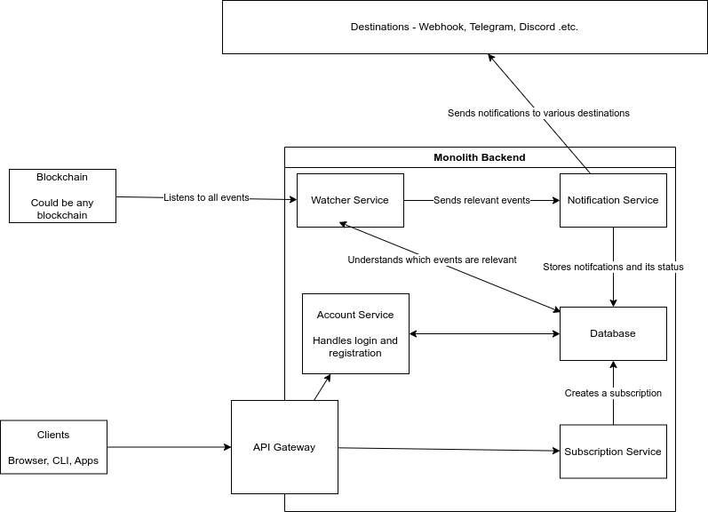

# Mempools Backend Implementation

## Scope

Backend MVP Scope: Cosmos Event Listener, Backend Service - ETA March 1st

Create an API Service that allows a user to:

1. Register or Log In once registered

2. Subscribe to a Cosmos Blockchain Event

3. Specify the Destination for the Notification
    - Begin with a simple Webhook that can be consumed by the user
    - Stretch Goal: Telegram, Discord

 4. Send the notification once the event was triggered
    - Record the Event that was received by the user
    - Stretch Goal: allow the user to view the list of received events

## Architecture

### Overview
The backend will be a rust monolith which will internally be divided into services such that it can be easily scaled to microservices in the future. The monolith will be horizontally scalable and resistant to unexpected shutdowns.

### API

Decided to go with OpenAPI over OpenRPC since it has a more mature ecosystem and supports more usecases at the cost of slight increase in complexity.

You can find the API spec [here](./openapi.json).

### Services

#### API Gateway
Service that all the clients will interact with - will handle API level logic such as setting cookies, compression .etc.

#### Subscription Service
Service that deals with any logic which relates to subscriptions. Will primarily create subscriptions for a user.

#### Account Service
Will handle account level logic for users such as authentication, authorization and storing global data that doesnt fit anywhere else.

#### Watcher Service
Crawls through every event that occured on the blockchain sequentially. Blockchain > Block > Transactions > Messages and events. Sends notification to every user subscribed to the event via the notification service. Tracks the status of transactions being processed using the database.

#### Notification service
This service only handles sending the actual notification and tracking its status. That watcher service decides what notifications to send.

### Storage
Will be opting for a KV database over standard relational database for the MVP since the schema is likely to rapidly change. Once the schema is stable we can transition easily to any other database as the storage layer code will be seprated from the services.